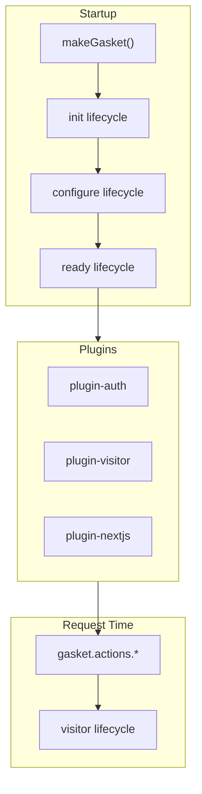

# Chapter 4: Core Concepts

## Chapter Overview

Gasket's power comes from four ideas: **`makeGasket`**, **plugins**, **lifecycles**, and **actions**. This chapter explains each and how they connect in your app.

---

## The Existing World

In a plain Next.js app, you wire integrations directly:

```text
next.config.js     → manual webpack/postcss edits
middleware.ts      → manual auth checks
pages/_document.ts → manual script tags for analytics
API routes         → direct SSO library calls
```

Every integration is ad hoc. Upgrades touch many files.

---

## The Gap / Problem

GoDaddy apps need many integrations that must:

- Compose without conflicting
- Upgrade independently
- Work across Pages Router, App Router, and custom servers

A **plugin orchestration model** was needed.

---

## `makeGasket()` — The Application Kernel

Everything starts in `gasket.ts`:

```ts
import { makeGasket } from '@gasket/core';

export default makeGasket({
  env: gdEnv(),
  plugins: [ /* ... */ ],
  httpsProxy: { /* ... */ },
  intl: { /* ... */ },
  data: gasketData
});
```

`makeGasket()` returns a **Gasket instance** with:

| Property | Purpose |
|----------|---------|
| `config` | Merged settings from all plugins |
| `actions` | Callable functions (`getNextConfig`, `checkAuth`, `getVisitor`, …) |
| `logger` | Structured logging (Winston via plugin) |
| `hooks` | Lifecycle execution engine (internal) |

Your compiled instance lives at `dist/gasket.js` and is imported as `@/gasket` in Next.js files.

---

## Plugins

A plugin is a module that registers **hooks** and optionally contributes **config defaults**:

```ts
export default {
  name: 'my-plugin',
  hooks: {
    ready(gasket) {
      gasket.logger.info('Plugin ready');
    }
  }
};
```

### Plugins in your app

| Plugin | Responsibility |
|--------|----------------|
| `@gasket/plugin-command` | CLI commands (`build`, `docs`) |
| `@gasket/plugin-dynamic-plugins` | Load plugins per environment/command |
| `@gasket/plugin-data` | Inject `gasket-data.ts` into SSR |
| `@gasket/plugin-nextjs` | Next.js integration |
| `@gasket/plugin-webpack` | Webpack customization |
| `@gasket/plugin-intl` | Localization manager |
| `@gasket/plugin-https-proxy` | HTTPS dev/production proxy |
| `@godaddy/gasket-plugin-auth` | SSO authentication |
| `@godaddy/gasket-plugin-security` | CSP and security headers |
| `@godaddy/gasket-plugin-visitor` | Market/PLID/reseller detection |
| `@godaddy/gasket-plugin-traffic` | Analytics and RUM |
| `@godaddy/gasket-plugin-uxp` | Presentation Central + UXCore2 |
| `@godaddy/gasket-plugin-atlas` | Brand/market configuration |
| `@godaddy/gasket-plugin-otel` | OpenTelemetry |
| `@godaddy/gasket-plugin-dev-certs` | Local development certificates |
| `@godaddy/gasket-plugin-self-certs` | Self-signed certificate support |

Plugins do **not** import each other directly. They communicate through Gasket's lifecycle system.

---

## Lifecycles

Lifecycles are **events** fired during startup, build, or request handling. Plugins register handlers:

```text
Startup pipeline:
  init → configure → prepare → ready

Build:
  build

Request-time (examples):
  visitor → modify detected visitor details
  presentationCentral → customize header/footer params
  tccData → customize Traffic data layer
```

Example — customizing visitor detection in a local plugin:

```ts
export default {
  name: 'my-visitor-plugin',
  hooks: {
    visitor(gasket, visitor, { req }) {
      // Return modified visitor object
      return visitor;
    }
  }
};
```

Common lifecycles in your app (from Gasket docs):

| Lifecycle | When |
|-----------|------|
| `ready` | Config complete, app can start |
| `build` | Before Next.js build (`prebuild` script) |
| `visitor` | Per-request visitor resolution |
| `presentationCentral` | Before fetching header/footer |
| `metadata` | Plugin self-description for docs |

Run `npm run docs` to see all lifecycles available in **your** configured app.

---

## Actions

Actions are **functions your application code calls**. They replace the older pattern of Express middleware attaching properties to `req`.

Example from `pages/api/auth/validate.ts`:

```ts
import gasket from '@/gasket';

export default async function handler(req, res) {
  const checkAuth = gasket.actions.getCheckAuth(req);
  const auth = await checkAuth(req.query);
  res.json(auth);
}
```

Other actions available in a typical webapp (via configured plugins):

| Action | Purpose |
|--------|---------|
| `getNextConfig()` | Build Next.js configuration |
| `startProxyServer()` | Start HTTPS proxy |
| `getCheckAuth(req)` | Auth validation for a request |
| `getVisitor(req)` | Visitor/market details |
| `getTrafficData(req)` | Traffic analytics payload |
| `getPresentationCentral()` | Header/footer content |
| `getLogger()` | Logger instance |

Actions enable the same patterns on Next.js default server **without** custom Express middleware.

---

## Environments

Gasket supports environment-specific config via `env` and `environments`:

```ts
export default makeGasket({
  env: gdEnv(),  // reads GASKET_ENV or Katana's GD_ENV
  environments: {
    'local.analyze': {
      dynamicPlugins: ['@gasket/plugin-analyze']
    }
  }
});
```

`gdEnv()` from `@godaddy/gasket-utils` resolves the active environment. Katana sets `GD_ENV` in deployed environments.

Typical values: `local`, `test`, `production`, plus custom ones like `local.analyze`.

---

## Dynamic Plugins

Not every plugin loads in every context. `@gasket/plugin-dynamic-plugins` enables conditional loading:

```ts
commands: {
  docs: {
    dynamicPlugins: [
      '@gasket/plugin-docs',
      '@gasket/plugin-metadata',
      '@gasket/plugin-docusaurus'
    ]
  }
}
```

Bundle analyzer plugins load only for `local.analyze`. Docs plugins load only for `npm run docs`. Production stays lean.

---

## How It Fits Together



---

## Common Mistakes

**Mistake:** Calling SSO libraries directly in pages instead of using `gasket.actions`.

**Why:** Bypasses visitor context, caching, and plugin lifecycle hooks.

**Better:** Use `@godaddy/gasket-auth` React components and `gasket.actions.getCheckAuth`.

---

**Mistake:** Adding business logic inside `gasket.ts`.

**Why:** Config file becomes unmaintainable; mixes wiring with domain rules.

**Better:** Keep `gasket.ts` for plugins and integration config. Put business logic in pages, services, or local plugins.

---

## Takeaways

1. **`makeGasket()`** creates the orchestration kernel.
2. **Plugins** register lifecycle hooks for platform integrations.
3. **Actions** are the request-time API your app code should call.
4. **Environments + dynamic plugins** keep production bundles small.
5. Prefer actions over reimplementing platform libraries directly.

---

## Next chapter

Continue to [Chapter 5: Runtime and Dev Workflow](./05-runtime-and-dev-workflow.md).

## References

[1] Gasket README — Lifecycles and Actions sections — `gasket-repo/README.md`  
[2] Server Features — `gasket-repo/docs/server-features.md`  
[3] Authoring Plugins — `gasket-repo/docs/authoring-plugins.md` (if present in repo)
