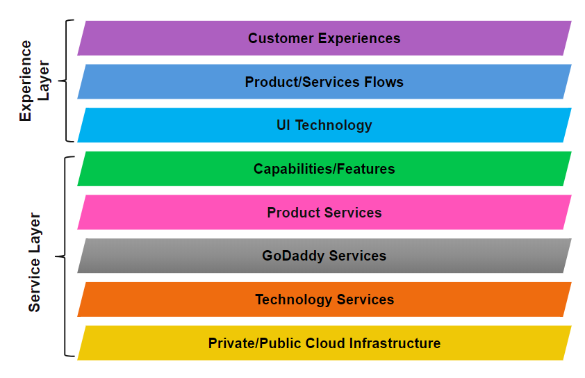

# Project Architecture

The following diagram described the architectural layers for building out
projects. The dependency of a project's layers should always go down, never up.

## Experience Layers

The **Customer Experiences** layer is the entry point for customers, and which
delineates where the web apps you build lie. The [webapp preset] provides the
framework which is part of the **UI Technology** layer, along with other
technologies such as UXCore2. With that said, Customer Experiences are web apps
created with the foundations and building blocks from UI Technologies.

## Service Layers

Web apps will need to make requests to APIs to retrieve data, post actions, and
the like. These exist in varying degrees in the **Service Layers**.

## Separation of concerns

While the [webapp preset] does utilize an Express server which makes it possible
to expose service-like endpoints from, it is recommended from an architectural
perspective not to do so. Exposing Express endpoints should only be used for
features directly related to the customer experience your web app provides. For
example, it may be necessary to use the Express server as a proxy for your web
app to make requests from the browser to an underlying API in the Service
Layers.

APIs can be implemented with NodeJS + Express, however, it should be an
independent app that lies in the Service Layers. Architecturally, this would
allow other services to utilize the API, as well as other web apps.

Back to our architecture diagram, because we don't want upward dependencies of
our architecture layers, this means we don't want an API in the service layers,
calling to an endpoint implemented with Gasket, resulting in the service API
having an upward dependency on the experience layers.

Besides the architectural goals, there are further practical benefits to
maintaining separation of service apps from experience web app. Examples include
independent implementations of strategies for deployments, failovers, resource
scaling, and others.

<!-- LINKS -->

[webapp preset]:/packages/gasket-preset-webapp/README.md
