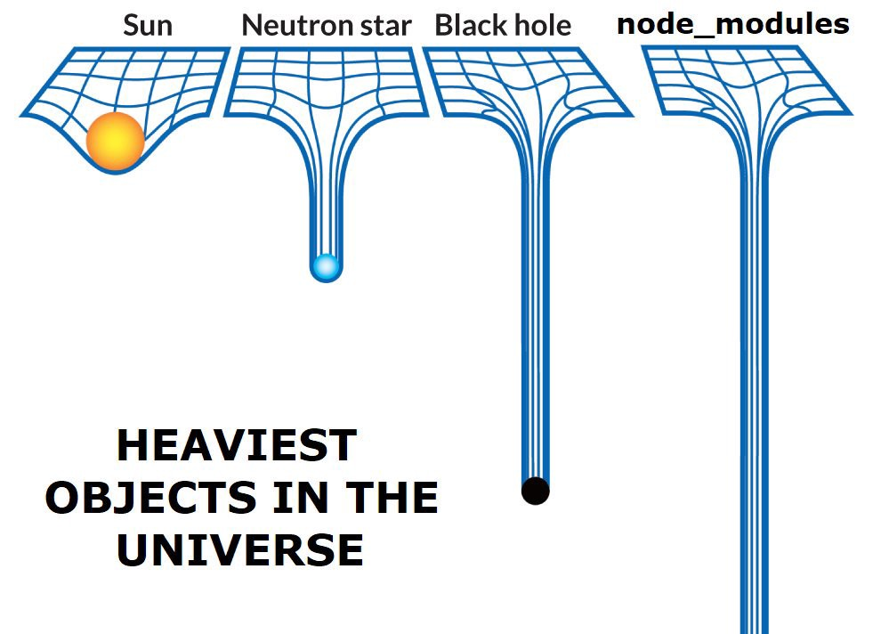

# GoDaddy Tech Stack

The GoDaddy Gasket webapp preset brings together a variety of technologies to
guide you in creating a standard GoDaddy web application. This document outlines
the various technologies available and the Gasket plugins that enable them.

But what are these technologies, and how do they tie together? This guide will
explain.

## Runtime Stack

The GoDaddy Gasket preset provides an HTTP/HTTPS application server that has
server-side rendering, auth, integration with the UX platform, and more. It also
provides a collection of components which you can use in your application code.
Here's what's included.

### Node.js

Apps are built on top of [Node.js], a standalone JavaScript engine. Having your
application built entirely in JavaScript on both the front-end and back-end is
what enables the universal rendering capabilities.

### Next.js

[Next.js] is a single-page-app (SPA) framework with server-side rendering (SSR),
hot module reloading, and code splitting capabilities. A Gasket plugin
integrates these capabilities into the overall framework.

### React

[React] is a component-based JavaScript framework for building user interfaces.
These components are used for both SSR and dynamic client-side HTML. All of your
application's web pages will be built using React components.

#### UXCore2

[UXCore2] is a collection of React components your application can use to create
UX consistent with other GoDaddy website. UXCore2 components are themes come from
[Presentation Central](#presentation-central) supporting up-to-date and consistent styling.

### Express

Inbound HTTP requests are handled by [Express], a very popular and minimalist
framework for building HTTP servers. Gasket provides a plugin to integrate
Express with the Gasket framework, allowing you to use Express middleware and
routing in your application.

### Fastify

Alternatively, you can use [Fastify], a fast and low-overhead web framework
that is also compatible with Gasket. Fastify is a great choice for building
high-performance applications, and it provides a powerful plugin architecture
that allows you to extend its functionality easily.

### Winston

GoDaddy Gasket apps provide a logger implemented through the highly customizable
[winston] library.

### webpack

The [webpack] bundler crawls your source code, spitting out assets as it goes.
Its behavior is hugely dependent on a set of rules, loaders, plugins, and other
configuration. Thankfully, Gasket compiles a webpack configuration compatible
with Next.js and UXCore2, while allowing you to merge in your own customizations.

## Quality Tools

GoDaddy Gasket also integrates with a variety of tools to aid developers in
producing quality source code.

### Linting & Style Enforcement

Linting is an inspection of your code for common problems that can lead to bugs
or code maintainability issues. Style enforcement ensures that naming in &
formatting of source code follows standardized conventions. Linting & style
enforcement are provided by the following tools:

#### ESLint

[ESLint] provides JavaScript & JSON linting and style enforcement rules. GoDaddy
has its own [company style standards][godaddy-style], which is automatically
configured for GoDaddy Gasket apps.

#### stylelint

The [stylelint] utility does linting and style enforcement for CSS files.

<!-- EXTERNAL LINKS -->

[Authentication Platform]: https://godaddy-corp.atlassian.net/wiki/spaces/AUTH/pages/89656000/Integration+Guide
[Babel]: https://babeljs.io/
[Chai]: http://www.chaijs.com/
[Enzyme]: http://airbnb.io/enzyme/
[ESLint]: https://eslint.org/
[Express]: http://expressjs.com/
[GoDaddy Experience System]: https://gxsys.uxp.int.godaddy.com/
[godaddy-style]: https://github.com/godaddy/javascript
[GoDaddy Traffic]: https://confluence.godaddy.com/pages/viewpage.action?pageId=32445161
[GoLF]: https://confluence.godaddy.com/display/GDI/GoLF+-+GoDaddy+Localization+Framework
[Istanbul]: https://github.com/istanbuljs/nyc
[Jest]: https://jestjs.io/
[jsdom]: https://github.com/jsdom/jsdom
[Mocha]: https://mochajs.org/
[Next.js]: https://nextjs.org/
[Node.js]: https://nodejs.org/en/
[Presentation Central]: https://github.com/gdcorp-uxp/presentation-central
[React]: https://reactjs.org/
[React Intl]: https://github.com/yahoo/react-intl
[PostCSS]: https://postcss.org/
[Sinon.JS]: https://sinonjs.org/
[stylelint]: https://github.com/stylelint/stylelint
[UXCore2]: https://github.com/gdcorp-uxp/uxcore2
[webpack]: https://webpack.js.org/
[winston]: https://github.com/winstonjs/winston

<!-- GASKET LINKS -->

[Intl Components]: https://github.com/godaddy/gasket/tree/main/packages/intl/README.md
[Intl Plugin]: https://github.com/godaddy/gasket/tree/main/packages/gasket-intl-plugin/README.md
[@gasket/plugin-express]: https://github.com/godaddy/gasket/tree/main/packages/gasket-plugin-express/README.md
[@gasket/plugin-jest]: https://github.com/godaddy/gasket/tree/main/packages/gasket-plugin-jest/README.md
[@gasket/plugin-mocha]: https://github.com/godaddy/gasket/tree/main/packages/gasket-plugin-mocha/README.md

<!-- REPO LINKS -->

[Auth Components]: /packages/gasket-auth/README.md
[Auth Plugin]: /packages/gasket-plugin-auth/README.md
[Header Component]: /packages/gasket-header-nav/README.md
[Traffic Plugin]: /packages/gasket-plugin-traffic/README.md
[UXP Plugin]: /packages/gasket-plugin-uxp/README.md
