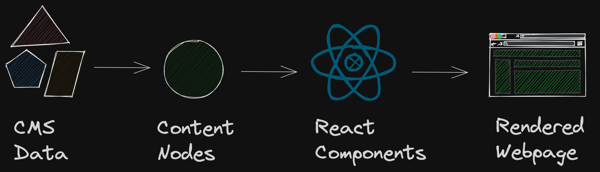
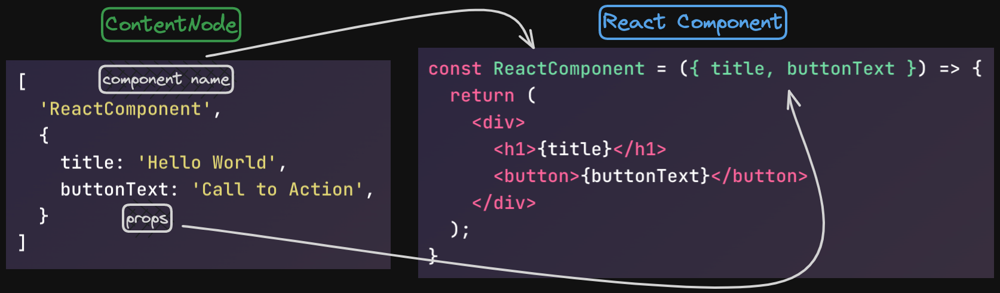
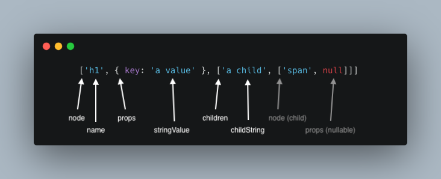

# @godaddy/gasket-content-nodes

Provides types and utilities for working with ContentNodes - An exchange format
used to bridge CMS data with renderers and content transformers.

## ContentNodes Background

In Storefront applications, the data used to compose a webpage's content and layout will typically be stored in a CMS. The exported JSON structure from any given CMS will vary based on the CMS provider (Contentful, Contentstack, etc.).

To standardize incoming CMS data, Storefront uses provider-specific plugins (example: [gasket-plugin-contentful]) to convert CMS data structures into a commonly used serializable JSON format called [ContentNodes].



ContentNodes are capable of being manipulated by [functions] supplied by this package for any necessary data massaging and describe what data should be supplied to components rendered by React.

```js
// Example of a single ContentNode
[
  'ReactComponent',
  {
    title: 'Hello World',
    buttonText: 'Call to Action',
  }
]
```

The ContentNode above describes a React component named `ReactComponent` with props `title` and `buttonText`. The image below shows how this ContentNode is mapped to a React component.



The code below shows the different forms the example data will take when it is converted from an ambiguous CMS data structure to rendered HTML using ContentNodes.

```tsx
// Pseudo data structure from a CMS
[
  {
    "content": {
      "contentName": "ReactComponent",
      "fields": {
        "title": "Hello World",
        "buttonText": "Call to Action"
      }
    }
  }
]

// ContentNode
[
  'ReactComponent',
  {
    title: 'Hello World',
    buttonText: 'Call to Action',
  }
]

// React component
const ReactComponent = ({ title, buttonText }) => {
  return (
    <div>
      <h1>{title}</h1>
      <button>{buttonText}</button>
    </div>
  );
}

// Rendered HTML
<div>
  <h1>Hello World</h1>
  <button>Call to Action</button>
</div>
```

## ContentNodes

A minimal JSON-serializable object model to describe a component hierarchy from
CMS data. The structure is a recursive tuple of `name`, `props`, and any `children`,
which must be an array containing ContentNodes or strings.

```ts
type ComponentName = string
type ComponentProps =  { [prop: string]: any } | null
type ContentNodeChildren = Array<ContentNode | string>

type ContentNode = [ComponentName, ComponentProps, ContentNodeChildren]
```

```ts
// ContentNode with no props and no children
['button', null]
// -> renders <button></button>

// ContentNode with props and no children
['button', { className: 'btn' }]
// -> renders <button class="btn"></button>

// ContentNode with props and a string child
['span', { className: 'btn-text' }, ['Submit']]
// -> renders <span class="btn-text">Submit</span>

// ContentNode with props and a child ContentNode with props and a string child
['button', { className: 'btn' }, [['span', { className: 'btn-text' }, ['Submit']]]]
// -> renders <button className="btn"><span class="btn-text">Submit</span></button>

// ContentNode with props and 3 ContentNode children with props and a string child
[
  'button',
  { className: 'btn' },
  [
    ['span', { className: 'btn-text' }, ['Submit1']],
    ['span', { className: 'btn-text' }, ['Submit2']],
    ['span', { className: 'btn-text' }, ['Submit3']]
  ]
]
// -> renders
// <button className="btn">
//  <span class="btn-text">Submit1</span>
//  <span class="btn-text">Submit2</span>
//  <span class="btn-text">Submit3</span>
// </button>
```

## Functions

### PartType

```ts
enum PartType {
  node = 'node',
  name = 'name',
  props = 'props',
  children = 'children',
  childString = 'childString',
  stringValue = 'stringValue',
  unknownValue = 'unknownValue'
}
```

This is an enum object with properties for each part of a ContentNode that can be
visited as the tree is traversed. Reference the above example for usage.



- `node` - a content node - equivalent to ReactNode
- `name` - tag of the node
- `props` - properties object
- `children` - array of content nodes or strings
- `childString` - a string intended to be rendered as a ReactNode
- `stringValue` - a prop value that is a string
- `unknownValue` - any other prop value

### transform

This will traverse the ContentNode tree, including the props. Visitors can be
assigned for any [PartType] of a ContentNode to perform various transformations.

#### Transform example

```tsx
import { transform, PartType } from '@godaddy/gasket-content-nodes';
import type { ContentNode, ContentNodeVisitors } from '@godaddy/gasket-content-nodes';

const visitors: ContentNodeVisitors = {
  // for any parts found that are strings ContentNode children
  [PartType.childString]: function (part: string, stopTraversal): ContentNode | string {
    // perform a check on the string
    if (hasHtml(part)) {
      // transform it to a ContentNode if needed
      return ['HtmlWrapper', { html: part }]
      // By default, transformed content will also be traversed
      stopTraversal()
    }
    // return the original part if no transformations are required
    return part
  }
}

const contentNodes = [
  ['h1', null, ['Hello <bold>World!</bold>']]
]

const results = transform(contentNodes, visitors)

results = [
  ['h1', null, ['HtmlWrapper', { html: 'Hello <bold>World!</bold>' }]]
]
```

The function traverses the tree beginning from the top node and walks down to
the leaf nodes.

### traverse

Under the hood of transform, this `traverse` function is used. This function
will crawl the ContentNode tree and send each [PartType] to a provided delegate
function. You can use the delegate to inspect the ContentNode parts for
information gathering or transformation.

#### Traverse example

In this example, the delegate passed to `traverse` will capture all the tags
or node names, in the ContentNode tree.

```ts
import { traverse, PartType } from '@godaddy/gasket-content-nodes';
import type { StopTraversal } from '@godaddy/gasket-content-nodes';

const allNodeNames = new Set()

function delegate(aPart: any, aPartType: PartType, stopFn: StopTraversal) {
  if (aPartType === PartType.name) {
    allNodeNames.add(aPart)
  }
  if (someCondition) {
    stopFn()
  }
  return aPart;
}

traverse(part, delegate, PartType.root);
```

Traversing will walk all the up to the leaf nodes; that is, ContentNodes without
children. Traversing can be ceased in a branch by executing the stop function
which is passed to the delegate.

### reverseTraverse

In other situations, it may be preferred to traverse the ContentNode tree,
starting from the leaf nodes, and walking backward to the root. The
`reverseTraverse` does just this, sending each [PartType] to a provided delegate
function.

#### Reverse traverse example

In this example, the delegate passed to `reverseTraverse` will add a new child
to certain ContentNodes. Walking in reverse will avoid this new child from also
being visited.

```ts
import { reverseTraverse, PartType } from '@godaddy/gasket-content-nodes';

function delegate(aPart: any, aPartType: PartType) {
  if (aPartType === PartType.node) {
    // destructure the node parts
    const [name, props, children] = aPartType
    if(name === 'SomeComponent') {
      children.push( ['ExtraComponent', { some: 'value' }] )
    }
  }
  return aPart;
}

reverseTraverse(part, delegate, PartType.root);
```

### reverseTraverseAsync

Like `reverseTraverse`, except that the delegate can be asynchronous.

```ts
import { reverseTraverseAsync, PartType } from '@godaddy/gasket-content-nodes';

async function delegate(aPart: any, aPartType: PartType) {
  if (aPartType === PartType.node) {
    // destructure the node parts
    const [name, props, children] = aPart
    if(name === 'SomeComponent') {
      // async delegate allows awaiting
      const extras = await fetch('https://some.api/extra/details');
      children.push( ['ExtraComponent', { some: 'value', extras }] )
    }
  }
  return aPart;
}

await reverseTraverseAsync(part, delegate, PartType.root);
```

### reverseTransformNodesAsync

This function allows you to transform specific ContentNodes by providing a ComponentName as input. This function uses `reverseTraverseAsync` to traverse the ContentNode tree and allows asynchronous calls in the delegate. The passed-in delegate must return `ContentNode | string | undefined`.

#### Reverse transform nodes async example

In this example, the delegate will match any ContentNode with a ComponentName of
`PriceToken`, and replace them with a string value it fetches from a service API.

```ts
import { reverseTransformNodesAsync, PartType } from '@godaddy/gasket-content-nodes';

function delegate(node: ContentNode) {
  const [, props] = node;
  const response = await fetch('https://example.service.api/?tld=' + props.tld);
  return (await response.json()).value
}

const contentNode = ['Section', null, ['Sales price: ', ['PriceToken', { tld: 'net' }]]]

await reverseTransformNodesAsync(contentNode, 'PriceToken', delegate);
// ['Section', null, ['Sales price: ', '$12.99']]
```

[PartType]: #parttype
[ContentNodes]: #contentnodes
[functions]: #functions
[gasket-plugin-contentful]: /packages/gasket-plugin-contentful/README.md
