# Component Modeling Guide

How we build our React **Components** influences how we approach
defining **Models** in a CMS, and vice versa. Because these topics go
hand-in-hand, we are going to discuss them together in this guide as
Component Modeling.

Each section leads off with the component nomenclature but will address the
modeling aspects. While modeling nomenclatures vary by CMS, we will use
Contentful conventions.

## Rendering

Before we get too deep into the modeling aspects, let us first take a look at
the steps of taking CMS content and rendering it in a Gasket Storefront app.

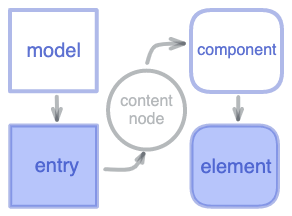

1. **Models** are defined in the CMS
2. **Entries** are made from the Models in the CMS
3. **[ContentNodes]** are translated from Entries in the Gasket app
4. **Components** (React) are mapped from the ContentNodes
5. **Elements** are rendered from the Components

## Components

**CMS Models are React Components.**

When designing our models, we should also plan for a corresponding React
component. Models and Components should have a 1 to 1 relationship.

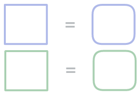

## Sub-Components

**Composable CMS Models are also React Components.**

The same is valid for Models intended as nested or composable
content. Any Model used for referenced or embedded Entries should also
correspond to a Component. Neither the degree of depth in a hierarchy
nor the simplicity or complexity should break this approach.

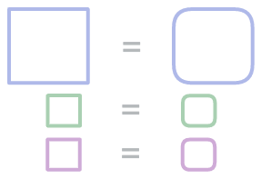

## Component Props

**Model Fields are Component Props.**

Naturally, the shape of the Model is its field which should correspond to the
Component's props. As such, only author Components with props compatible with
the basic types available to the CMS Models.

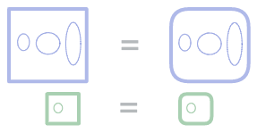

For example, these are how some CMS Model field types might relate to the
Components prop types.

- text (string)
- boolean
- number
- reference (ReactNode)
- rich text (ReactNode)

Of course, string, number, and boolean primitives pair as expected. When setting
up reference entries or rich text, these fields should have corresponding prop
types, which expect React elements.

```tsx
interface ComponentProps {
  title: string
  height: number
  emphasis: boolean
  subComponent: SubComponent
  description: ReactNode  // rich text
}

// alternative prop type declaration
Component.propTypes = {
  title: PropTypes.string,
  height: PropTypes.number,
  emphasis: PropTypes.boolean,
  subComponent: PropTypes.instanceOf(SubComponent),
  description: PropTypes.node  // rich text
}
```

### Avoid Changing Props

Once a Model and Component are defined, changes to props and fields should be
avoided. While new fields can be added and old fields deprecated, existing field
types and usages should not be changed.

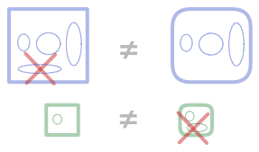

### Map Prop with Facades

If a pre-existing Component and/or Model are being associated, handle any
in-between changes at the component level. For example, a "facade" Component could be
introduced which wraps the old, and handles the differences and field to prop
"mapping". Alignment iterations can be addressed directly in the malleable
Component code while the Model is left intact. Treat models as immutable with
their fields fixed, as these are the most difficult to change through a CMS.

_Of course, exceptions may occur when processing certain models. Handling these
situations will be discussed in a follow-up Content Transforms Guide._

### Flatten Grouped Props

When authoring Components, it is sometimes an organizational choice to group
certain properties under an object. However, this does not translate
consistently well to CMS Model fields. Instead, if it is helpful to instill a
grouping emphasis to certain props, do so by using field name prefixes.

```diff
interface ComponentProps {
  title: string
-  notice: {
-    label: string
-    icon: string
-    border: boolean
-  }
+  noticeLabel: string
+  noticeIcon: string
+  noticeBorder: boolean
}

function Component(props: ComponentProps) {
-  const noticeStyle = props.notice.border ? 'noticeBorder': ''
+  const noticeStyle = props.border ? 'noticeBorder': ''
  
  return <>
    <h1>{props.title}</h1>
    <div className={noticeStyle}>
-      {props.notice.label}
-      {props.notice.icon}
+      {props.noticeLabel}
+      {props.noticeIcon}
    </div>
  </>
  </>
}
```

### Group Models are Components

If the number of fields becomes unwieldy, possibly bumping up to the CMS limits,
these could also be grouped in Models, meaning they should also be paired to
Components.

```tsx
interface NoticeComponentProps {
  label: string
  icon: string
  border: boolean
}

function NoticeComponent(props: NoticeComponentProps) {
  const noticeStyle = props.border ? 'noticeBorder': ''
  
  return <div className={noticeStyle}>
    {props.label}
    {props.icon}
  </>
}

interface ComponentProps {
  title: string
  notice: NoticeComponent
}

function Component(props: ComponentProps) {
  return <>
    <h1>{props.title}</h1>
    {props.notice}
  </>
}
```

Allowing certain content to be shared by referencing entries from other Models
can be a time and resource savings approach. This leads to our next topic
of [Shared Components].

## Shared Components

**Contextually Style Shared Components.**

When styling is crafted into the SubComponent, it may limit its usefulness when
other drastically different styled parent Components share entries.

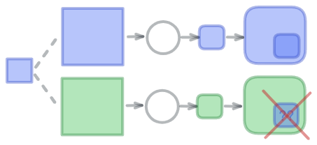

If you find possibilities for sharing Model entries (child SubComponent) by
referencing from other Models (parent Component), take care that the
corresponding SubComponent is flexible enough to allow for styling assignments
by the parent Component.

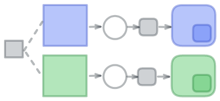

This approach will also avoid unnecessary duplication of Models and
Components for just mere styling differences.

### Code Example

```tsx
interface SubComponentProps {
  label: string
}

function SubComponent(props: SubComponentProps) {
  return <button className='cta'>{props.label}</button>
}

enum DisplayType {
  primary = 'primary',
  secondary = 'secondary',
  trinary = 'trinary'
}

interface ComponentProps {
  type: DisplayType
  cta: SubComponent
}

function Component(props: ComponentProps) {
  return (
    <div className={`component ${props.type}`}>
      {props.cta}
    </div>
  )
}

css`
  .component.primary > .cta {
    backgroundColor: blue;
  }
  .component.secondary > .cta {
    backgroundColor: green;
  }
  .component.trinary > .cta {
    backgroundColor: violet;
  }
`
```

## Switch Components

**Single Component with Varying Appearances.**

When design appearances for content are drastically different, this can
influence how you build the React components.

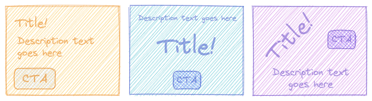

When you identify that some Component designs contain similar props to others
Components, consider setting up a single common Model in the CMS. This singular
Model could have a switch field such as (i.e. `layout`, `display`, `type`) and
be associated with a Switch Component - a Component whose appearance is
determined via switch props.

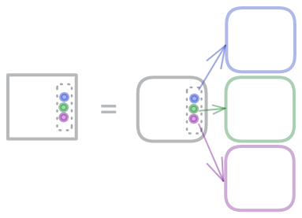

The Switch Component may not have any direct styling associated with it.
Instead, the styling would be defined by other conditionally rendered components
based on the incoming switch prop.

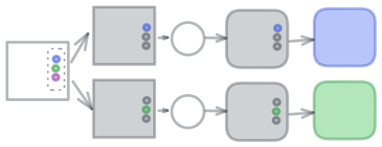

This approach allows for greater flexibility in Component appearances while
limiting the number of Models required to manage in the CMS.

### Code Example

```tsx
import type { ReactNode, ComponentType } from 'react';

enum DisplayType {
  primary = 'primary',
  secondary = 'secondary',
  trinary = 'trinary'
}

interface DisplayProps {
  title: string
  description: ReactNode
  cta: ReactNode
}

function Primary(props: DisplayProps) {
  return <section className="primary-section">
    <h1>{props.title}</h1>
    {props.description}
  </section>;
}

function Secondary(props: DisplayProps) {
  return <section className="secondary-section">
    <div>{props.description}</div>
    <h2>{props.title}</h2>
    <center>{props.cta}</center>
  </section>;
}

function Trinary(props: DisplayProps) {
  return <section className="trinary-section">
    <h2 className="tilt-left">{props.title}</h2>
    <div style={{ float: 'right' }}>{props.cta}</div>
    <p className="fancy">{props.description}</p>
  </section>;
}

const typeMap: Record<DisplayType, ComponentType<DisplayProps>> = {
  [DisplayType.primary]: Primary,
  [DisplayType.secondary]: Secondary,
  [DisplayType.trinary]: Trinary
};

interface ComponentProps extends DisplayProps {
  type: DisplayType
}

export function Component(props: ComponentProps) {
  const DisplayComponent = typeMap[props.type];
  return <DisplayComponent
    title={props.title}
    description={props.description}
    cta={props.cta}>
  </DisplayComponent>;
}
```

### Considerations

If Models for Switch Components become too generic, you may miss out on some
CMS editor validation features. Balance becoming too generic with becoming
too redundant with your Models.

## Abstract Components

Until now, we have been covering Components that could likely exist
in a pattern library package, separate from an app. However, there may be cases
where a library component needs app-specific information which cannot be
populated from CMS data.

For these situations, consider treating the library component as an abstraction
that needs a concrete implementation in the app.

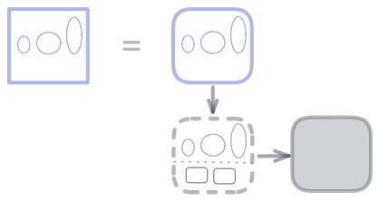

The CMS Model fields would match up to the implementation Component's props,
while the implementation Component addresses the props required by the Abstract
Component.

### Code Example

```tsx
import { AbstractComponent, ImplementationProps } from '@some/component-library'

export function Component(props: ImplementationProps) {
  return <AbstractComponent
    // non-CMS required props
    appName='my-app'
    apiUrl='https://some.api'
    apiKey='my-key-123456789'
    apiHandler={() => { /* app handler function */
    }}

    // CMS driven props
    {...props}
  ></AbstractComponent>
}
```

## Naming Conventions

**Models and Components are `UpperCamelCase` / `PascalCase`.**

**Fields and props are `lowerCamelCase` / `camelCase`.**

Field name conventions or restrictions can vary by CMS, such as
Contentstack's `snake_case` requirement. However, continue to adhere to
the `lowerCamelCase` convention for the Component props, and expect the
translation of CMS data to ContentNodes adjusts the field names appropriately.


[Switch Components]: #switch-components
[Shared Components]: #shared-components
[ContentNodes]: /packages/content-nodes/README.md#contentnodes
