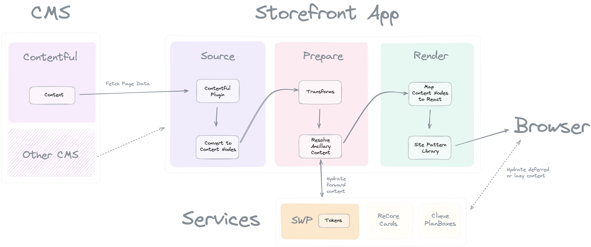

# Content Services Guide

Sometimes the values in that content are not know by the editor. Things like
pricing, user discounts, and personalized information cannot be authored
directly in the CMS. External services must provide dynamic data of this sort.
That is where Content Service Plugins come in.




## Plugins

In a CMS, an editor must create placeholder content for where they want
a price or other dynamic content to show. For example, we will represent a
simple page with [contentNodes]:

```json5
['Page', null, [
  ['ExampleBanner', { title: 'Special Price' }, [
    "Today's .xyz sale price is:",
    ['PriceToken', { tld: '.xyz' }]
  ]]
]]
```

To substitute in the correct sales price for the example token above,
a content service plugin will need to hook the [contentTransform] lifecycle,
find the `PriceToken`, and reach out to a pricing service to get the current
version.

```ts
import { reverseTransformNodesAsync, PartType } from '@godaddy/gasket-content-nodes';

function makeDelegate(cookie) {
  return async function delegate(node: ContentNode): string {
    const [name, props] = node
    const response = await fetch('https://example.service.api/?tld=' + props.tld, { headers: { cookie } });
    return (await response.json()).value
  }
}

export const name = 'example-service-plugin';
export const hooks = {
  async contentTransform(gasket, contentNode, context) {
    if(context.req?.headers?.cookie) {
      return await reverseTransformNodesAsync('PriceToken', makeDelegate(req.headers.cookie));
    }
    
    return contentNode
  }
}
```

In this example content service plugin, it will find any contentNode's called
`PriceToken`, and replace them with a string value it fetch from a service API.

Pay attention now to the context check. For this service plugin transform, the
replacement to be sure only to happen when this is for a non-static server-side
render request. If a static page is being rendered (thus no req or cookies),
then the original `PriceToken` contentNodes will be returned.

This allows service plugins the ability to support rendering static (forward)
or lazy (deferred) content. For the lazy or deferred `PriceToken`, we will need
a React component that knows how to get the correct value from the browser.

## Components

```tsx
import { useState, useEffect } from 'react';
import type { ReactElement } from 'react';
import { response } from 'express';

export function PriceToken(props: { tld: string }): ReactElement {
  const [value, setValue] = useState<string | null>(null)

  useEffect(() => {
    fetch('https://example.service.api/?tld=' + props.tld, { credentials: 'include' })
      .then(async response => {
        const results = await response.json()
        setValue(results.value)
      })
  }, [])

  if (value) {
    return value
  }

  return <span class='spinner'>Loading</span>
}
```

As you can see, this component will display a loading spinner until it is able
to fetch the correct value from the same service.

## Endpoints

In some cases, the service may not be accessible from the browser, either not
publicly available or requires a Cert JWT or something. In these cases, the
content service plugin can expose a proxy endpoint by hooking the [express]
and/or [fastify] lifecycles.

```ts
// -- snipped --

export function setupEndpoints(gasket: Gasket, app: Application): void {
  const { basePath } = gasket.config?.content ?? {};
  const route = [basePath, 'api/price-token'].join('/');

  app.get(route, async (req: Request, res: Response) => {
    const { tld } = req.query
    const { cookie } = req.headers
    const response = await fetch('https://example.service.api/?tld=' + tld , { headers: { cookie } });
    res.send(await response.json())
  });
}

export const hooks = {
  contentTransform,
  express: setupEndpoints,
  fastify: setupEndpoints
}
```

With this, the React component can be updated to fetch from the relative
`/api/price-token` endpoint.

## Summary

Obviously, the above examples do not have error handling or are optimized for
fetch batching. However, this should serve as a starter guide for setting up
dynamic content provided by services outside the CMS.

The above examples demonstrate interacting with a service whose content was
simple strings. However, what if the content is more complex? Let's take a look.

## Complex Content

In our CMS, we will add an entry for a `DynamicSection`. This section will
need to retrieve some information about the requesting user before it can be
fully displayed. Our resulting contentNodes may look like this:

```json5
['Page', null, [
  ['ExampleBanner', { title: 'Special Price' }, [
    "Today's .xyz sale price is:",
    ['PriceToken', { tld: '.xyz' }]
  ]],
  ['DynamicSection', {
    product: 'domains',
    filter: 'expiring',
    title: ['LocalizedString', { text: 'Do not let these Domains expire!' }]
  }]
]]
```

Our page is static, so we don't want to render this on the server, but
wait for fetching details in the browser. Now, the `LocalizedString` will be
resolved by a transform, becoming a string before it gets passed along to the
component, which we will look at next:

```tsx
import { useState, useEffect } from 'react';
import type { ReactElement } from 'react';
import { response } from 'express';

interface ItemDetails {
  // lot's of item detail attributes
}

interface SectionDisplayProps {
  title: string
  items: Array<ItemDetails>
}

export function DynamicSection(props: { product: string, filter: string, title: string }): ReactElement {
  const [displayProps, setDisplayProps] = useState<Partial<SectionDisplayProps> | null>(null)

  useEffect(() => {
    const url = new URL('https://example.service.api')
    url.searchParams.append('product', props.product)
    url.searchParams.append('filter', props.filter)
    fetch(url, { credentials: 'include' })
      .then(async response => {
        const results = await response.json()
        setDisplayProps(results)
      })
  }, [])

  if (displayProps) {
    return <DynamicSectionDisplay {{ ...displayProps, title: props.title }} />
  }

  return <span class='spinner'>Loading</span>
}

// The actually fancy display component once personalized data is fetched
export function DynamicSectionDisplay(props: SectionDisplayProps): ReactElement {
  return (
    <section>
      <h2>{ props.title }</h2>
      {
        props.items.map(itemDetails => {
          return <div>stuff about the item here</div>
        })
      }
    </section>
  )
}
```

With the above, a `DynamicSection` React component will be rendered on the
static page, and the final `DynamicSectionDisplay` component rendered in the
browser after details are fetched from the content service.

However, what if we want to use this same content service on a server-side
render page? For that we simply need to introduce a plugin with a
contentTransform that is capable of fetching from the content service.

```ts
import { reverseTransformNodesAsync, PartType } from '@godaddy/gasket-content-nodes';

function makeDelegate(cookie) {
  return async function delegate(node: ContentNode): string {
    const [name, props] = node
    const url = new URL('https://example.service.api')
    url.searchParams.append('product', props.product)
    url.searchParams.append('filter', props.filter)
    
    const response = await fetch(url, { headers: { cookie } });
    const displayProps = await response.json()
    return ['DynamicSectionDisplay', { ...displayProps, title: props.title }]
  }
}

export const name = 'example-service-plugin';
export const hooks = {
  async contentTransform(gasket, contentNode, context) {
    if(context.req?.headers?.cookie) {
      return await reverseTransformNodesAsync('DynamicSection', makeDelegate(req.headers.cookie));
    }
    
    return contentNode
  }
}
```

Now with this contentTransform, we fetch details from the content service then
return the final `DynamicSectionDisplay` in our contentNodes to be rendered
directly server!

As you can see, no matter how simple or complex the dynamic content may be,
interfacing with a content service for Storefront Apps will involve at
most 3 parts:
- React component to fetch dynamic content for deferred browser rendering
- A contentTransform plugin to fetch content for forward server-side rendering
- React component for the final display render
